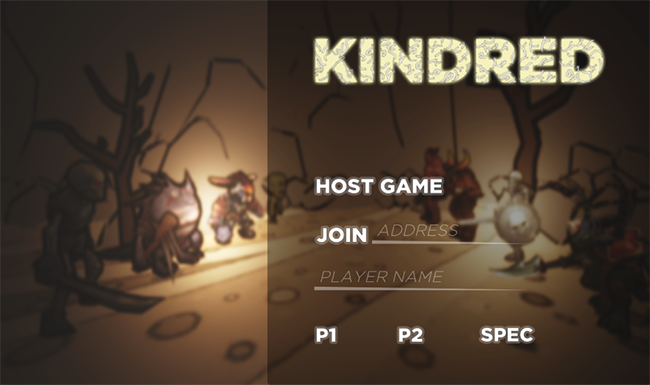

# Kindred

Kindred is an augmented reality multiplayer game that revolves around turn-based matches between two opponents, each controlling a set of minions with unique skills. Victory is achieved once the opposing side has no minions remaining.

Kindred was fully developed in Unity 5.2, and uses UNet for all its network processing. For augmented reality, Kindred relies on Vuforia SDK for Unity. At the moment, due to Vuforia's limitations, Kindred is only available for mobile platforms (although it can played inside Unity's official editor). All the assets presented in-game were available for free in Unity's Asset Store at the time of development.

## Screenshots

## Usage Instructions

In order to setup a game of Kindred, users should follow the recommended steps below:

- Kindred needs a server for each match. Players must choose a nickname and a role in the match (either P1 or P2, noting that P1 takes controls during the first round). In order to watch a match, or simply host a server, users should join as SPEC.
- During the setup phase, players must present their own minions (the ones they will control during the game) to the camera, and click the "Ready"button once all minions are visible.
- Throughout the game, the arena will present gameplay instructions and tips on one of its sides.
- Once a winner is decided, the server is stopped and all players are returned to the main menu.